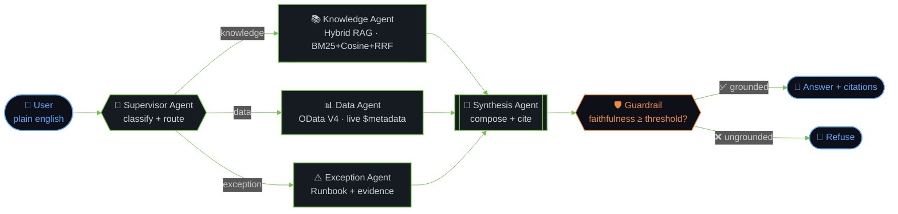

<div  align="center">

  


  

<br/><br/>

  

[](https://git.io/typing-svg)

  

[](https://puneeth-reddy.vercel.app/)

[](https://www.linkedin.com/in/puneeth-reddy-75069824b/)

[](mailto:puneethreddyt2004@gmail.com)

[](https://github.com/puneethx)

  

</div>

  

---

  

## 🧠 whoami

  

```yaml

name: T Puneeth Reddy

role: AI Application Engineer · Forward Deployed Engineer

company: Infosys · Bangalore, India

focus: Agentic AI · Multi-Agent Orchestration · Grounded RAG

shipping: Production Joule + LangGraph agents on SAP BTP

featured: SAP SAPPHIRE 2026 · SAP Business Accelerator Hub (3 agents published by SAP)

mission: Take agents from a notebook idea → to real users → to measurable outcomes

```

  

> 🤖 I build agents that **do things**, not just chat. Retrieval-grounded, tool-using, multi-step, audited — and running against real enterprise SAP workloads.

  

---

  

## 🕸️ The Agent Graph I Ship Every Day

  

Because a screenshot beats a bullet list. This is roughly what my day looks like:

  



  

That's **SAP Enterprise Copilot** — 5 agents on LangGraph, hybrid retrieval, deterministic grounding. No hallucinated answers get out the door.

  

---

  

## 🚀 Currently Shipping

  

<table>

<tr>

<td width="50%" valign="top">

  

### 🤖 SAP MAO Warehouse Agent

**Live at SAPPHIRE 2026 · Published on SAP Accelerator Hub**

  

A multi-agent Joule system that acts as **the brain behind a fleet of 120 autonomous robots**. When a robot hits an empty-bin exception, my agents:

  

- 🔎 Diagnose the exception in real time

- 📦 Locate the next valid bin via EWM

- 🚦 Reroute the robot or trigger putaway from reserve storage

- ✍️ Write the resolution back to HANA — no human logs into SAP

  

`Supervisor` → `Inventory` → `Logistics` agents · Joule Studio · SAP BTP

  

</td>

<td width="50%" valign="top">

  

### 🦾 DRA — Humanoid Robot Agent

**Under active development · Infosys R&D**

  

The follow-up to SAPPHIRE. Same agentic backbone, but now driving a **humanoid** through pick-and-place, navigation, and inspection tasks — all via plain-english prompts.

  

- 🧭 Supervisor classifies task → routes to specialist

- 👁️ Vision system feeds the inspection agent

- 🔁 Failure-recovery loop being built out now

  

Because manipulating physical space is the ultimate agentic benchmark.

  

</td>

</tr>

<tr>

<td width="50%" valign="top">

  

### 🔐 SAP Security Audit Agent

**Published on SAP Accelerator Hub**

  

Auditors ask in plain english — *"which roles allow creating a sales order?"* — the agent generates **ABAP Open SQL** against `AGR_USERS` / `AGR_1251` / `USR02`, executes read-only via OData on BTP, and streams a clean table into the chat. Hours → seconds.

  

</td>

<td width="50%" valign="top">

  

### 🔍 SAP Search + Troubleshooter Agents

**Published on SAP Accelerator Hub**

  

Two Joule agents (+ a Python/ReAct twin) that **query-expand**, scrape live SAP Help / Notes / Community, and synthesize structured answers with citations. The Python version runs a ReAct loop with three specialized Tavily tools + GPT-4.1 via SAP AI Core.

  

</td>

</tr>

</table>

  

---

  

## 🧰 Tech I Actually Use

  

<details open>

<summary><b>🤖 Agentic AI & GenAI</b> — where I spend most of my time</summary>

  


  

</details>

  

<details open>

<summary><b>⚙️ Backend, APIs & Runtime</b></summary>

  


  

</details>

  

<details open>

<summary><b>🏢 SAP Stack</b> — where the agents run</summary>

  


-0057A4?style=flat&logo=sap&logoColor=white)


  

</details>

  

<details>

<summary><b>🧪 ML / Computer Vision</b> — where I started</summary>

  


  

</details>

  

<details>

<summary><b>🎨 Frontend & Everything Else</b></summary>

  


  

</details>

  

---

  

## 🏆 Wall of Wins

  

- 🎤 **SAP SAPPHIRE 2026** — contributed to an agent showcased live at SAP's biggest global conference

- 📦 **3 Joule Agents published to SAP Business Accelerator Hub — by SAP themselves**

- 🥇 **Winner** · Proglint CV 2K23 National Hackathon (Alliance University, Bangalore)

- 🥈 **1st Runner-up** · SheCodes by WTM Reva — Llava-8B + R3F adaptive learning

- 🥈 **1st Runner-up** · HackQuest by I-Quest (VIT-AP) — YOLO + OCR traffic AI

- 🥈 **1st Runner-up** · FrameX Web Hackathon (CSI, VIT-AP)

- 📜 **Claude Certified Architect — Foundations**

  

---

  

## 📊 GitHub Stats

  

<div  align="center">

  


  


  


  


  

</div>

  

---

  

## 🌐 Let's Talk

  

<div  align="center">

  

If you're building agents, shipping GenAI to real users, or figuring out how to keep LLMs honest with retrieval and guardrails — I'd love to trade notes.

  

[](https://www.linkedin.com/in/puneeth-reddy-75069824b/)

[](https://instagram.com/puneethx)

[](mailto:puneethreddyt2004@gmail.com)

[](https://puneeth-reddy.vercel.app/)

  

<sub>*"The interesting part isn't that it chats — it's that it acts, grounded and auditable."*</sub>

  

</div>
